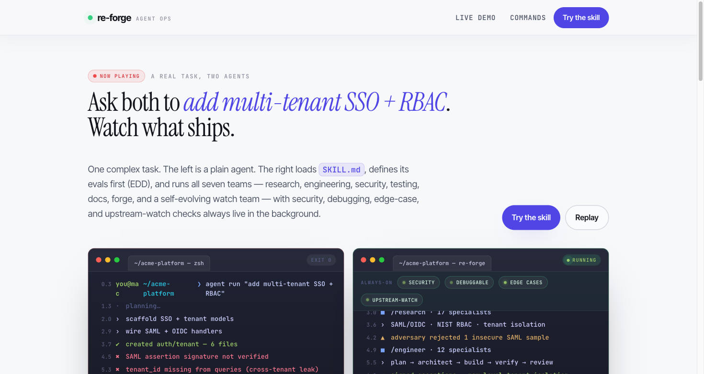

# re-forge

[](https://github.com/TheAdaply/re-forge/actions/workflows/ci.yml)

re-forge is a hardened operating procedure for [Claude Code](https://claude.ai/code)'s native subagent and agent-teams primitives — adversarial gating, institutional memory, and on-disk evidence baked into a multi-role research protocol. It is for operators who need their agents to disagree, audit each other, and remember, not for users who just need one assistant to edit a file.

Status: v0.4 pre-release. Installed and validated end-to-end in CI (fresh-HOME install + doctor on every push); team protocols are in active use but interfaces may still move before v1.

**Get started in 5 minutes →** see [QUICKSTART.md](./QUICKSTART.md).

## Slash commands

Seven user-callable commands. Type `/<name>` in any Claude Code session after `bash setup.sh` and a restart. Cost/time figures are typical, calibrated against the v0.2 validation session (`BENCHMARKS_v0.2.md`); a single dispatch can fan out to 17+ specialists in parallel.

| Command | Dispatches | Typical wall-clock | Typical token cost |
|---|---|---|---|
| `/research` | Research Team (17 specialists) — multi-source investigation with adversarial gates (skeptic + adversary + moderator + evaluator) and a 5-dim evaluator rubric | 2–30 min | 50K–500K |
| `/engineer` | Engineering Team (12 specialists) — plan → architect → skeptic → executor → verifier → reviewer loop; reads a research SYNTHESIS as binding spec | 5–60 min | 100K–800K |
| `/security` | Security & Review Team — CVE check, secrets scan, threat model, license audit; auto-detects language/dependency manager | 3–10 min | 30K–150K |
| `/testing` | Testing & QA Team — coverage, mutation testing, property tests, regression detection | 5–30 min | 50K–300K |
| `/docs` | Documentation Team — author + verify README/API docs/changelogs/architecture | 3–15 min | 20K–120K |
| `/forge` | Capability Forge — gap detection → MCP/marketplace scout → draft → test → promote new skills | 5–20 min | 30K–200K |
| `/evolution` | Evolution Team — scouts upstream Claude Code/Cursor/Codex releases, shadows live sessions for workflow gaps, emits a ranked adoption strategy | 5–20 min | 30K–200K |

A first-run `/research` on a deliberately-narrow toy question (see QUICKSTART) lands a SYNTHESIS in 2–3 minutes for well under 50K tokens.

## How re-forge compares

re-forge is **a hardened operating procedure for Claude Code's native subagent + agent-teams primitives**, not a runtime, not a graph engine. The differentiators that survive a skeptical engineer:

1. **Adversarial gating is contractual** (every SYNTHESIS re-audited by skeptic + adversary).
2. **Cross-session memory with helpful/harmful counters** (vanilla agent-teams stores nothing across sessions).
3. **A forge meta-agent that evolves the workforce** (none of the alternatives below attempts this).

Comparison rows checked 2026-06; ecosystem moves fast — verify before depending on a row.

| Alternative | Install | Why pick re-forge over it |
|---|---|---|
| Claude Code native subagents + agent-teams | bundled | adversarial gating + cross-session memory + on-disk EVIDENCE substrate |
| LangGraph | `pip install langgraph` | stay inside Claude Code REPL; no graph runtime to deploy |
| AutoGen | `pip install autogen-agentchat` | **AutoGen is in maintenance mode** (Microsoft now points users at Microsoft Agent Framework) |
| CrewAI | `uv pip install crewai` | built-in adversary/skeptic/moderator vs polite-collaboration default |
| Mastra / Inngest / Trigger.dev | `npm create mastra` etc. | re-forge is interactive investigations; these are HTTP-endpoint workflows |
| Goose (block/goose) | `curl … \| bash` | re-forge optimizes for Claude protocols, not provider portability |
| Aider | `pip install aider-install` | different problem class — single-agent pair programming |

**Persona this is built for:** a research-heavy IC or 2–5 person team running multi-week investigations across multiple codebases who has already noticed Claude Code single-sessions hallucinate citations, anchor early, and forget yesterday's lessons.

## Used in practice

Two papers whose research and engineering runs were orchestrated with re-forge teams were accepted to the [SCALE Workshop at ICML 2026](https://scale-icml-2026.github.io/):

- **Compute-Aware Mixture-of-Agents: Verifier-Gated Adaptive Aggregation under a Fixed Token Budget** — Shine Gupta, S Akash ([OpenReview](https://openreview.net/forum?id=reVvPpjoje), public at camera-ready)
- **Who Hallucinates Tools, How Often, and What Fixes It?** — S Akash, Shine Gupta ([OpenReview](https://openreview.net/forum?id=njwFtNF0OW), public at camera-ready)

Findings from both fed back into the agents' prompts (tool-registry re-prompting and verifier-gated aggregation patterns).

## What's inside

### 6 teams + 1 meta-agent

| Team | Leader | Agent files | Purpose |
|---|---|---|---|
| **Research Team v2.1** | `research-lead` | 18 | Investigate any question with adversarial gates (skeptic + adversary + moderator + evaluator) |
| **Engineering Team v1** | `engineering-lead` | 13 | Ship code from research findings via plan-then-build with verifier + reviewer loop |
| **Security & Review** | `security-lead` | 14 | CVE check, secrets scan, threat model, license audit |
| **Testing & QA** | `testing-lead` | 12 | Coverage, mutation testing, property tests, regression detection |
| **Documentation** | `docs-lead` | 12 | Author + verify README/API docs/changelogs/architecture |
| **Evolution** | `evolution-lead` | 8 | Scout upstream releases, shadow sessions, rank what to adopt next |
| **Capability Forge H1** | `forge-lead` | 5 sub-skills | Detect workforce gaps, scout MCP Registry + marketplaces, author new skills |

The full generated inventory (every team agent + all 128 skills, with descriptions) lives in [docs/CATALOG.md](./docs/CATALOG.md) — built from frontmatter by `scripts/build_catalog.py` and drift-checked in CI, so it cannot go stale.

### Key features

- **Self-evolving memory**: ACE-pattern (generation/reflection/curation) via retrospector + scribe. Lessons accumulate across sessions and transfer across projects
- **Adversarial gates**: Skeptic (attacks reasoning) + adversary (attacks sources for SEO fraud, citation laundering, astroturfing) + evaluator (5-dim rubric) before "high confidence"
- **Structured debate**: Moderator runs 3-round debates with 5 verdict types (A_WINS, B_WINS, COMPLEMENTARITY, REFRAME, DEFER) instead of lead arbitrating with bias
- **Full-activation enforcement**: Evidence-file-as-contract ensures every specialist actually runs. Audit script catches shortcuts
- **Parallel orchestration**: Run 4+ teams concurrently with file-locked memory segregation (measured once in an internal session — 10 concurrent writers, ~70ms, zero lost writes; figure recorded in `agents/engineering-team/engineering-scribe.md`)
- **Per-project isolation**: Sessions are project-local (`<cwd>/.claude/teams/`), infrastructure is global (`~/.claude/`)
- **All Opus by default**: Every agent declares the strongest model at max effort; on lower plans dispatches fall back to the plan's strongest available model

### Research-backed design

| Source | What we imported |
|---|---|
| [Anthropic multi-agent research system](https://www.anthropic.com/engineering/multi-agent-research-system) | Orchestrator-worker, 5-dim rubric, scaling rules |
| [Anthropic "Building effective agents"](https://www.anthropic.com/research/building-effective-agents) | Workflow/agent distinction, evaluator-optimizer |
| [MAST failure taxonomy](https://arxiv.org/abs/2503.13657) (NeurIPS 2025) | 14 failure modes mapped to specialist ownership |
| [ACE: Agentic Context Engineering](https://arxiv.org/abs/2510.04618) (Stanford) | Generation/reflection/curation loop |
| [DebateCV](https://arxiv.org/abs/2507.19090) | Structured debate for contradictions |
| [Magentic-One](https://arxiv.org/abs/2411.04468) (Microsoft Research) | Ledger-based orchestration, bounded retry |
| [Memory in the Age of AI Agents](https://arxiv.org/abs/2512.13564) (47 authors) | Forms x Functions x Dynamics taxonomy |

## Quick start

### Prerequisites

- [Claude Code](https://claude.ai/code) CLI installed
- Claude Max plan recommended (agents declare Opus at max effort; lower plans downgrade to their strongest model)
- `gh` CLI authenticated (`gh auth login`)
- Python 3.11+ (for the audit script and memory-mcp)
- `uv` / `uvx` recommended (for the arxiv MCP server and the validation harness)

### Installation

```bash
git clone https://github.com/TheAdaply/re-forge.git
cd re-forge
bash setup.sh           # installs all 6 teams + forge + 128 skills + hooks
bash scripts/doctor.sh  # verify install — exits 0 only on a clean, complete install
```

Then restart Claude Code so it reloads agents and skills.

The installer copies agents, team protocols, scripts, hooks, skills, and the forge to `~/.claude/`, auto-discovering every `agents/*-team/` and every `memory/*.md`, and registers three hooks (Stop, PostToolUse, SessionStart) in `~/.claude/settings.json` (created if absent; snapshotted before any merge). It backs up any file it would change (and only those — re-runs are no-ops). To remove everything it installed: `bash scripts/uninstall.sh --force` (your `agent-memory/` lessons and third-party skills are left untouched; run without `--force` for a dry run). The exact inventory is [docs/CATALOG.md](./docs/CATALOG.md); the install layout is verified by `scripts/doctor.sh` and exercised on every push by [CI](https://github.com/TheAdaply/re-forge/actions/workflows/ci.yml)'s fresh-HOME smoke test.

### First run

```bash
cd ~/my-project
claude

# Research something
/research how vLLM handles MoE routing

# Implement from research
/engineer implement Hook A from the memory-layer research

# Check workforce gaps
/forge what capability are we missing?
```

For a deliberately narrow first dispatch (toy question, low token cost, SYNTHESIS in 2–3 min) follow [QUICKSTART.md](./QUICKSTART.md).

### Dashboard

```bash
bash ~/.claude/scripts/team_status.sh
python3 ~/.claude/scripts/audit_evidence.py <slug> --gate=synthesis --strict -v
```

## How it works

### The self-evolution loop

```
Research Team investigates a question
  -> SYNTHESIS.md with adversarial-gated findings
  -> retrospector writes durable lessons to MEMORY.md
  -> scribe deduplicates via ACE grow-and-refine

Engineering Team implements the recommendation
  -> reads research SYNTHESIS as binding spec
  -> plan -> architect -> skeptic -> executor -> verifier -> reviewer
  -> writes handback to research workspace

Capability Forge detects gaps
  -> /forge:gap (inventory + taxonomy diff)
  -> /forge:scout (MCP Registry + marketplaces)
  -> /forge:draft -> /forge:test -> /forge:promote
  -> tracks skill value via helpful/harmful counters

Every session makes the next one smarter.
```

### Spec-driven long-horizon flow

For multi-week work, conversations drift; contracts don't. The [spec-driven](./skills/spec-driven/SKILL.md) skill freezes each feature into a requirements → design → tasks → verification chain with grep-able trace IDs, and the teams execute against it: `/research` investigates, the spec locks the contract, `/engineer` builds to it, `/testing` verifies against requirement IDs. Pairs with the EDD contract (`agents/EDD-ADDENDUM.md`) that every team already follows.

### Memory architecture

Uses the [ACE pattern](https://arxiv.org/abs/2510.04618):
- **Generator**: retrospector extracts 3-7 durable lessons per session
- **Reflector**: durability test ("would this help in 3 months on an unrelated question?")
- **Curator**: scribe merges, deduplicates, marks stale entries

Memory is global (transfers across projects). Sessions are per-project (evidence stays isolated). Hook A routes long-tail overflow to topic files with reference pointers.

### Why adversarial gates matter

Most multi-agent systems fail by adding agents without adding verification. Re-forge imports the [MAST taxonomy](https://arxiv.org/abs/2503.13657) and assigns each failure mode to a specialist:

- **Skeptic** attacks reasoning (FM-3.3)
- **Adversary** attacks sources: SEO farms, benchmark fraud, citation laundering (FM-3.3 corpus variant)
- **Moderator** runs structured debates on contradictions (FM-2.5)
- **Evaluator** grades output on 5 dimensions (FM-3.2)

The adversary caught [MemPalace's misleading benchmarks](https://github.com/MemPalace/mempalace/issues/214) (50K+ stars, 96.6% LongMemEval R@5 score that actually measured a vanilla ChromaDB lookup, not MemPalace's palace architecture) during the first pilot. The skeptic alone couldn't have caught this — the corpus claim looked plausible until the adversary read the benchmark file.

### Parallel execution

```python
Agent({ subagent_type: "research-lead", prompt: "...", run_in_background: true })
Agent({ subagent_type: "engineering-lead", prompt: "...", run_in_background: true })
```

Memory segregation: retrospectors write to `staging/<slug>.md`, scribes merge via flock + timeout + atomic-rename. Empirically validated with 4 concurrent teams.

## Customization

### Adding a new team

Follow the self-evolving principle:
```
/research how a Testing/QA team should be structured
```

Research-lead produces a SYNTHESIS with a ready-to-write team design. Write the files and pilot.

### Adding skills via the Forge

```
/forge build a skill that wraps the Semantic Scholar API
```

The Forge wraps Claude Code's official `skill-creator` and `mcp-builder`.

### Memory layer phases

| Phase | Status | What |
|---|---|---|
| Hook A | Shipped | Topic-file routing for long-tail lessons |
| Hook B | Shipped, manual opt-in | SQLite + FTS5 MCP server ([memory-mcp/](./memory-mcp/), not auto-installed; boot-tested in CI) |
| Hook C | Spike plan ready | LatentMAS KV-cache handoff |
| Parametric | Direction | LoRA distillation of stable lessons |

## How it was built

This system was built by Claude researching how to build itself:

1. **Self-evolution rounds 1-2**: Research-lead audited itself, found 12 defects against MAST + Anthropic patterns, expanded from 12 to 17 specialists
2. **Memory layer pilot**: First v2 protocol run on a real question. Caught MemPalace fraud. Evaluator PASS 5/5
3. **4 parallel research sessions**: Engineering Team + deeper memory specs + Capability Forge + full-activation protocol. All HIGH confidence
4. **Smoke tests**: Engineering implemented Hook A, Forge authored hn-search skill. Both passed
5. **Infrastructure hardening**: 15 agents upgraded to Opus, Stop hook installed, arxiv MCP, scope model refactored

Total: ~2M tokens, ~600 tool calls, ~8 hours of agent compute across 2 days.

## Troubleshooting

If `/research`, `/security`, `/testing`, or `/docs` fails with a missing-file error, your install drifted from the repo. Run `bash scripts/doctor.sh` from inside your re-forge clone — it diffs every `agents/*-team/` and every `memory/*.md` against `~/.claude/` and reports each missing file. Pass `--fix` to re-run `setup.sh` and repair drift in place: `bash scripts/doctor.sh --fix`. Exit code 0 means clean; 1 means drift detected.

## Showcase

A small Vite/React site presenting the system lives in [showcase/](./showcase/) (built and linted in CI):



## License

[MIT](./LICENSE)

## Contributing

Run the system, let the retrospector accumulate lessons, share what your team learned. If you build a new team, submit it with the research SYNTHESIS that designed it.

## v0.2-rc — Security/Testing/Docs teams activated (2026-05-01)

The three teams drafted-but-unactivated in v0.1 — **Security**, **Testing**, **Docs** — are now installable. v0.2 was validated end-to-end on `gpucheck v1.0.0rc1` (4-track parallel implementation + 26-process kernel-fuzzer swarm + ~100 distinct agent dispatches). See `RELEASE_NOTES_v0.2.md` for measured deltas, known limitations, and install steps.